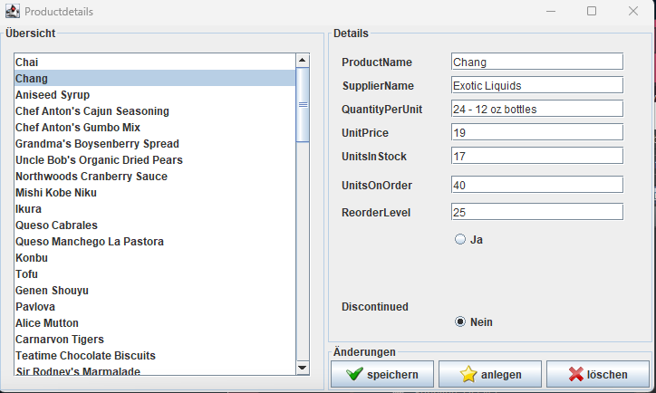
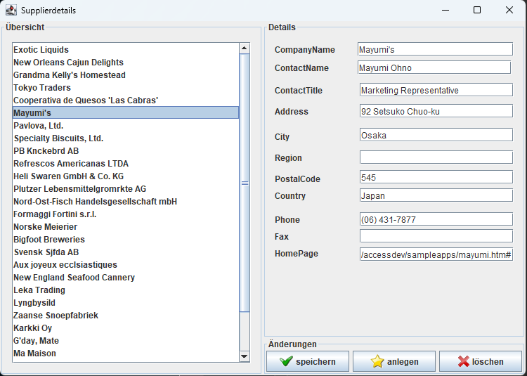

# NorthWind
NorthWind DB Client

Der NorthWind DB Client besteht aus zwei GUI Masken.
Eine für die Produkt Tabelle und eine für die Supplier Tabelle.

In der GUI ist nur die `SELECT` Lokig implementiert die Insert und Delete funktionen sind im Sourcecode enthalten werden aber aus zeitlichen Gründen nicht von der GUI angesteuert.

Hierfür wurden UnitTests bereitgestellt um die Funktionalität zu Testen.

Übersicht über die Produkt Maske:

Übersicht über die Lieferanten Maske:

Die Implementierung der SQL Transaktionen findet in der Klasse `DBConnector` statt.
Der Aufruf und die Verarbeitung der SQL Queries findet in den Klassen `ProductsAdapterDB` und `SuppliersAdapterDB` statt.